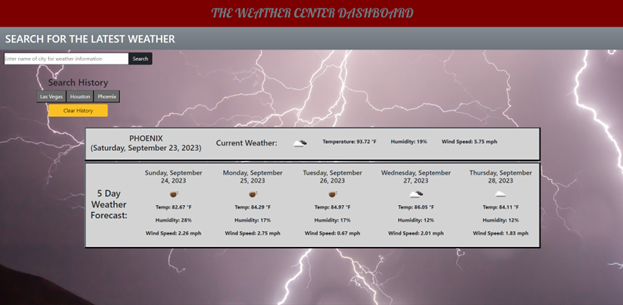

# Weather Dashboard Challenge

## Description
This challenge requires a deployed weather dashboard with form inputs for searching cities. The city searches will display current and future weather conditions for the particular city that a user searches for and is added to a search history. The user should be able to view the current weather conditions for the particular city with the city name, the date, an icon representation of weather conditions, the temperature, the humidity, and the wind speed. When the user views teh future weather conditions for the particular city, a 5-day weather forecast diplays the date, an icon representation of weather conditions, the temperature, the humidity, and the wind speed. When the user clicks on a city in the search history, the user is, again, presented with the current and future weather conditions for the particular city that the user clicks on to view. This is a screenshot of the weather dashboard.

## Installation

N/A

## Usage

The webpage can be found here: https://sctwomey.github.io/sturdy-happiness/

## Credits

N/A

## License

Please refer to the LICENSE in the repo.